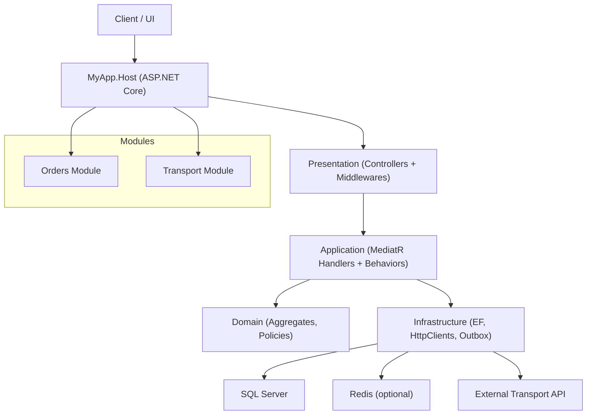
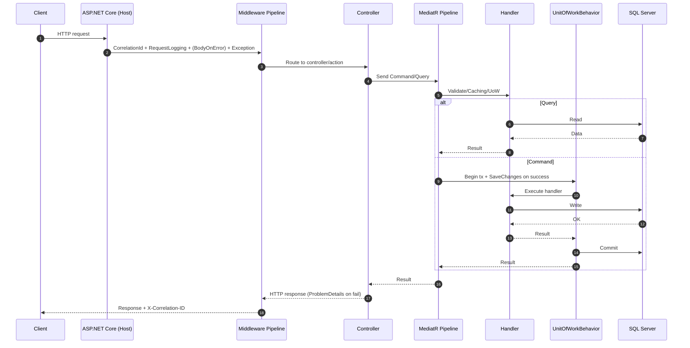
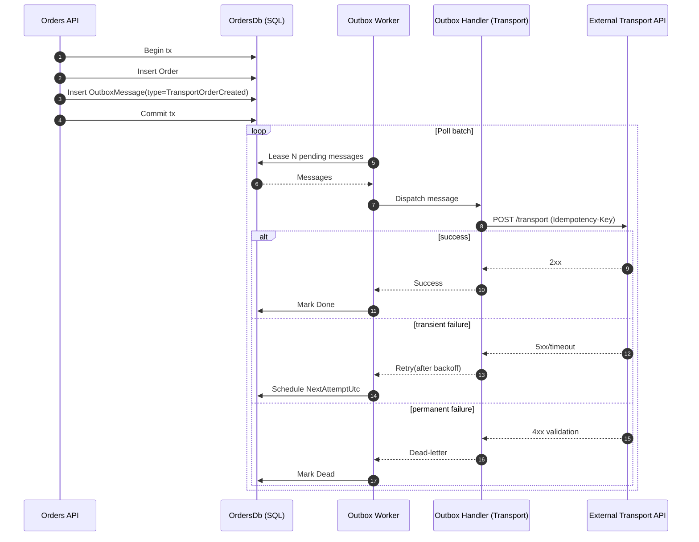

# MyApp — Modular Monolith Clean Architecture Template

Production-ready ASP.NET Core template built as a **Modular Monolith** with a **clean migration path to microservices**.

This project demonstrates a real-world architecture used in production systems:

- Clean Architecture per module
- CQRS with MediatR
- FluentValidation
- Explicit Result Pattern (`MessageResult`)
- Outbox Pattern for reliable integrations
- Observability-first logging
- Transaction boundaries via MediatR pipeline

---

## Table of Contents

### Getting Started
- [Quick Start](#quick-start)
- [Configuration](#configuration)

### Architecture
- [Project Structure](#project-structure)
- [Architecture diagram (C4)](#architecture-diagram-c4)
- [Request lifecycle](#request-lifecycle)
- [HTTP Pipeline](#http-pipeline)
- [MediatR Pipeline](#mediatr-pipeline)
- [Unit of Work](#unit-of-work)
- [Result Pattern](#result-pattern)

### Integrations
- [Outbox Pattern](#outbox-pattern)
- [Sequence diagram: Outbox flow](#sequence-diagram-outbox-flow)
- [Transport Integration](#transport-integration)
- [Idempotency](#idempotency)

### Observability
- [CorrelationId](#correlationid)
- [Request Logging](#request-logging)
- [Body Capture](#body-capture)

### Development
- [Adding a Module](#adding-a-module)
- [Adding a Use Case](#adding-a-use-case)

### Deployment & Scaling
- [Production Checklist](#production-checklist)
- [Migration to Microservices](#migration-to-microservices)

### Full Documentation
- [docs/README_EXTENDED.md](docs/README_EXTENDED.md)

---

## Quick Start

### Requirements

- .NET 8+
- SQL Server
- Redis (optional)

### Run

```bash
dotnet restore
dotnet run --project src/MyApp.Host
```

---

## Configuration

Important configuration sections:

| Section | Purpose |
|------|------|
| ConnectionStrings:OrdersDb | Orders module database |
| ConnectionStrings:Redis | Redis cache / body store |
| Outbox:Orders | Outbox worker configuration |
| Observability | Logging & request capture |

See a full configuration example and detailed notes in **docs/README_EXTENDED.md**.

---

## Project Structure

```text
src/
  BuildingBlocks/
  IntegrationContracts/
  Modules/
  MyApp.Host/
docs/
  README_EXTENDED.md
```

Modules follow **Clean Architecture**:

```text
Domain
Application
Infrastructure
Presentation
```

Modules **do not reference each other directly**. Integration happens through:

- Outbox
- Integration contracts
- HTTP (optional)

---

## Architecture diagram (C4)

Pasteable **Mermaid** C4-style diagram for README.



---

## Request lifecycle



---

## HTTP Pipeline

Order of middleware:

```text
CorrelationIdMiddleware
RequestLoggingMiddleware
BodyOnErrorLoggingMiddleware
GlobalExceptionMiddleware
Controllers
```

---

## MediatR Pipeline

Order of behaviors:

```text
RequestLoggingBehavior
ValidationBehavior
QueryCachingBehavior (queries)
UnitOfWorkBehavior (commands)
Handler
```

---

## Unit of Work

Default rule:

Handlers **must not**:
- open transactions
- call `SaveChanges`

Transaction boundaries are controlled by **UnitOfWorkBehavior**.

### Exception hatch

If a use case needs **database identity during execution** (e.g., `order.Id`):

- request implements `ISkipUnitOfWorkBehavior`
- handler owns: `ExecutionStrategy` + explicit transaction + `SaveChanges` steps

Used in: `CreateOrderAndDispatchTransport`.

---

## Result Pattern

Handlers return:

- `MessageResult`
- `MessageResult<T>`

Error contract:

- `ErrorData` (Code, Key, Args, Description)

Errors are translated to **ProblemDetails** at API boundary.

---

## Outbox Pattern

Integration backbone of the system.

Ensures:
- reliable integration
- retry on failures
- no lost messages

### Sequence diagram: Outbox flow



---

## Transport Integration

Transport module consumes Orders outbox and calls external Transport API.

Outbound request includes:

- `Idempotency-Key` header to prevent duplicate side effects
- `X-Correlation-ID` (propagated)

---

## Idempotency

Implemented:
- idempotent outbound calls
- idempotency key stored in outbox envelope

Recommended (optional):
- inbound idempotency store for create endpoints

---

## Observability

System includes:

| Feature | Description |
|---|---|
| CorrelationId | request tracing |
| RequestLogging | HTTP summary logs |
| Body capture | request/response capture (optional) |
| Structured logs | JSON logs + scopes |

---

## CorrelationId

Header:
- `X-Correlation-ID`

Behavior:
- propagate if provided
- generate if missing
- return in response
- attach to logs
- propagate to outbound HTTP

---

## Request Logging

Logs:
- method
- path
- status
- latency

Optional:
- headers
- query string

Sensitive values are redacted.

---

## Body Capture

`BodyOnErrorLoggingMiddleware`

Captures payloads only when needed.

Supports:
- Redis store
- SQL store
- TTL expiration

Default: **disabled**.

---

## Adding a Module

1) Create: `src/Modules/<Module>`
2) Create projects: Domain, Application, Infrastructure, Presentation, Contracts
3) Add assembly markers per layer
4) Register module in host: `services.Add<Module>Module(...)`
5) Map UoW routing for module’s Application assembly
6) Define integration contracts if needed

---

## Adding a Use Case

### Query
```csharp
public sealed record GetOrder(int Id) : IQuery<OrderDto>;
```

### Command
```csharp
public sealed record CreateOrder(...) : ICommand<CreateOrderResponse>;
```

### Validator
```csharp
public sealed class CreateOrderValidator : AbstractValidator<CreateOrder> { }
```

---

## Production Checklist

Implemented:
- CorrelationId propagation (inbound + outbound)
- Structured logging
- ProblemDetails boundary
- Error localization (RESX)
- Outbox retry/backoff
- Query caching (Memory/Redis)
- Optional payload store (Redis/Sql) with TTL

Recommended:
- rate limiting
- health checks (db/redis/downstream)
- OpenTelemetry exporter wiring (traces/metrics)
- centralized log aggregation
- inbound idempotency store

---

## Migration to Microservices

Because modules are isolated, extraction is mechanical:

1) Move module to new service repo
2) Give it its own DB
3) Keep IntegrationContracts as shared NuGet
4) Keep Outbox in owning service
5) Replace in-process integration with HTTP/message broker
6) Remove module from monolith host

---

## Full Documentation

Deep dive:

- docs/README_EXTENDED.md
